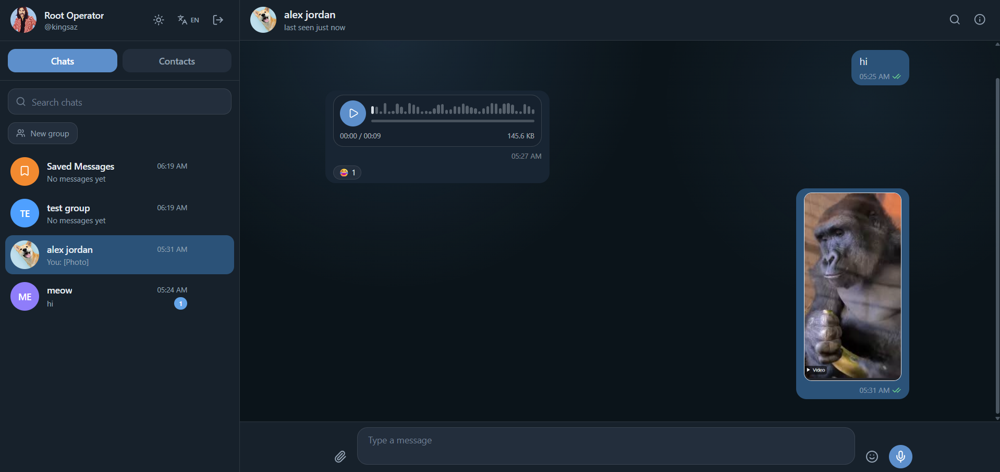
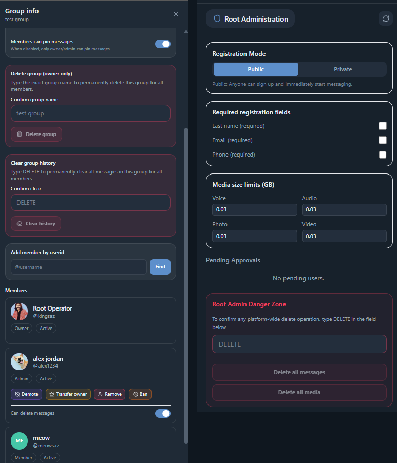

# Nexus Messenger

Languages: [English](README.md) | [فارسی](README.fa.md)

Version: 1.0.0  
Project status: Stable v1.0.0  
Self-hosted real-time messenger

Built with AI-assisted development. Product direction, testing, and release review by Ashin Team.

Nexus Messenger is a self-hosted real-time messaging platform for direct chats, groups, media sharing, voice messages, presence, reactions, read receipts, and Docker-based deployment.

Docker Compose is the canonical v1.0.0 deployment path. The automated installer CLI is planned for a future release.

## Why this project exists

Nexus Messenger started as an experiment: how far can AI-assisted development go in building a real, self-hosted chat application when the human creator does not write the code line by line?

The idea, product direction, testing, review, and release decisions were handled by the human creator. The implementation was built through iterative AI-assisted development.

The goal was not to clone a giant messaging platform. The goal was to build a focused, modern, self-hosted messenger with the core features people expect from a real chat product: direct messages, groups, real-time updates, media, roles, presence, and deployment tooling.

The project was also motivated by a simple frustration: many self-hosted and team chat tools can feel too heavy or too complex for smaller use cases. Nexus Messenger aims to be cleaner, more direct, and easier to understand.

## Preview





## Features

- Direct chats and group chats
- Group owner, admin, member, permission, ban, and ownership-transfer flows
- Real-time messaging with Socket.IO
- Message replies, editing, deletion, pinning, search, reactions, unread counters, and read receipts
- Typing indicators and presence/online status
- Media and file sharing with upload limits
- Voice message recording and playback
- Contacts and user lookup
- Root admin bootstrap, private registration approval, registration settings, media limits, and administrative cleanup controls
- English and Persian UI support with RTL layout support
- Progressive Web App (PWA) support for installable app-like use
- Docker Compose deployment with PostgreSQL and Redis

## Tech Stack

- Frontend: React 19, TypeScript, Vite, Tailwind CSS
- Backend: Node.js 22, Express, TypeScript
- Database: PostgreSQL
- Realtime/cache: Socket.IO and Redis
- Deployment: Docker Compose

## Prerequisites

- Node.js 22 or newer
- npm
- Docker Engine or Docker Desktop
- Docker Compose plugin

## Local Development

Install dependencies:

```bash
npm ci
npm --prefix backend ci
```

Create local environment files:

```bash
cp .env.example .env
cp backend/.env.example backend/.env
```

Edit both `.env` files and set strong values for database passwords, `JWT_SECRET`, `JWT_REFRESH_SECRET`, `DEFAULT_ROOT_USERNAME`, and `DEFAULT_ROOT_PASSWORD`.

Start the development stack:

```bash
npm run dev:all
```

This starts PostgreSQL and Redis in Docker, the backend API on `http://localhost:4000`, and the Vite frontend on `http://localhost:3000`.

The root/admin user is bootstrapped on startup from `DEFAULT_ROOT_USERNAME` and `DEFAULT_ROOT_PASSWORD`. There is no separate public installer command in v1.0.0.

Useful checks:

```bash
npm run typecheck
npm run build
npm --prefix backend run typecheck
npm --prefix backend run build
```

## Docker Compose Deployment

Copy the production environment template:

```bash
cp .env.example .env
```

Set production values before starting:

- `JWT_SECRET`
- `JWT_REFRESH_SECRET`
- `POSTGRES_PASSWORD`
- `APP_DB_PASSWORD`
- `DEFAULT_ROOT_USERNAME`
- `DEFAULT_ROOT_PASSWORD`
- `CLIENT_ORIGIN`
- `COOKIE_SECURE=true`
- `TRUST_PROXY=true` when behind a trusted reverse proxy
- `RESET_ROOT_PASSWORD_ON_BOOT=false`

Build and start:

```bash
docker compose up -d --build
```

Check service status:

```bash
docker compose ps
curl -H "X-Forwarded-Proto: https" http://127.0.0.1:3005/health
```

By default, the app port is bound to localhost. Put Nexus Messenger behind an HTTPS reverse proxy such as Nginx or Caddy for production use.

Run migrations for existing databases:

```bash
docker compose --profile migrate run --rm migrate
```

Fresh Docker volumes are initialized from `backend/sql/init.sql`; migrations are for existing databases.

## Environment Files

Use the example files as templates:

- `.env.example` for Docker Compose production/runtime configuration
- `.env.docker.example` as an alternate Docker-focused template
- `backend/.env.example` for backend development

Never commit real `.env` files. The examples intentionally contain placeholders only.

## Production Security Checklist

- Set strong, unique secrets and database passwords.
- Do not commit `.env`, tokens, private keys, database dumps, or uploaded media.
- Use HTTPS through a trusted reverse proxy.
- Keep uploads, storage, and backups private as appropriate for your deployment.
- Back up PostgreSQL data, Redis data if needed, and uploaded storage.
- Review exposed ports; the default Compose file binds app, PostgreSQL, and Redis ports to localhost.
- Keep dependencies and base images updated.
- Keep `RESET_ROOT_PASSWORD_ON_BOOT=false` in production.
- Leave link previews disabled unless you explicitly want the server to make outbound HTTP requests.

## Known Limitations

- End-to-end encryption is not included in v1.0.0.
- User and group avatars are public by design in this version.
- Public media/avatar behavior should be reviewed for your threat model before internet exposure.
- The installer/CLI is future roadmap; Docker Compose is the supported v1.0.0 deployment path.
- v1.0.0 is a first stable public release, not a mature enterprise messaging suite.
- The backend smoke test is guarded and requires explicit environment variables plus a disposable database.

## Roadmap

- Automated installer/CLI
- Improved deployment automation
- Optional end-to-end encryption research
- More admin and moderation tools
- Better backup/restore ergonomics

## Repository Layout

```text
backend/        Express API, Socket.IO server, SQL schema, migrations
components/     Stable frontend compatibility wrappers and shared UI
features/       Frontend feature modules
hooks/          Shared frontend hooks
services/       Frontend API, socket, config, and adapters
shared/         Shared UI, i18n, and frontend utilities
deploy/         Public deployment templates
scripts/        Local development utilities
```

## Contributing

See [CONTRIBUTING.md](CONTRIBUTING.md) for local setup, checks, issue reporting, and pull request expectations.

## Security

See [SECURITY.md](SECURITY.md) for supported versions and vulnerability reporting.

## License

MIT License  
Copyright (c) 2026 Ashin Team
